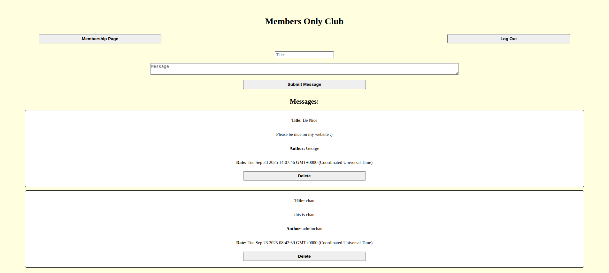

# TOP‑Members‑Only

The secret code to enter the club is "George" (case sensitive).

A role-based messaging app where members can publish anonymous posts. Non-members see limited message details. Admins can moderate content through protected actions posts.

This project uses authentication and PostgreSQL to manage users and messages.

---

**Site link:** https://top-members-only-production-12e9.up.railway.app/

---

  

---

## Secret Club Code

To become a member, you’ll need the secret code:

**George** (case sensitive)

---

## Features

- **Authentication (Sessions + Passport):** Users sign in to make comments and become members.
- **Role-based access control**
  - Non‑members: limited message details
  - Members: can view author + timestamp
  - Admins: can delete posts
- **PostgreSQL** persistence for users + messages

---

## Tech Stack

| Layer          | Technology               |
| -------------- | ------------------------ |
| Back-end       | Node.js, Express         |
| Front-end      | EJS                      |
| Database       | PostgreSQL               |
| Authentication | Passport (session‑based) |
| Language       | TypeScript               |
